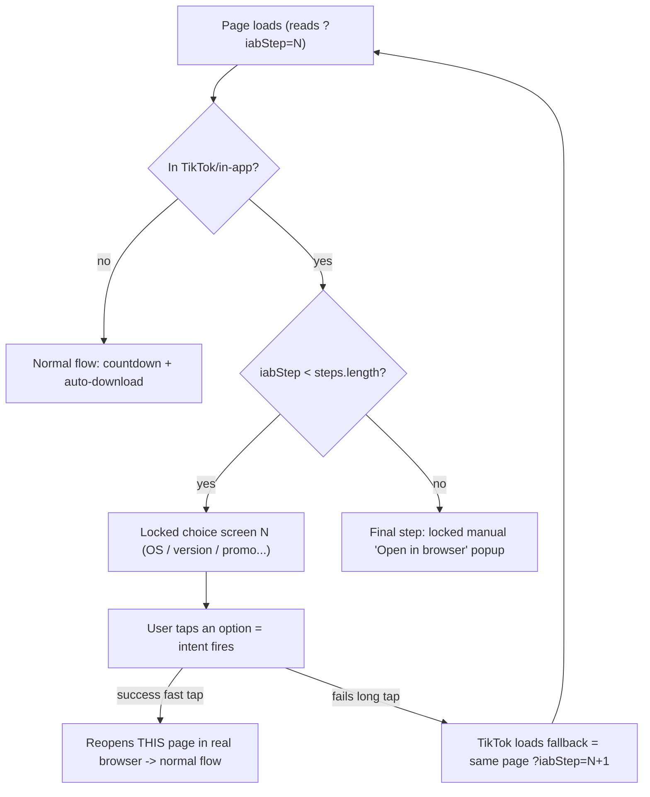

# Predownload multi-step intent gate

Integrate the multi-fallback-intent idea into the single predownload page [predownload-flow/meccha-download.html](predownload-flow/meccha-download.html), removing the need for multiple hand-authored HTML files. All work is in that one file.

## How it works

Each choice-screen option is an `intent://` link. If the intent fires (fast tap) the user escapes TikTok back onto this same page in a real browser, where the normal countdown/download runs. If the intent silently fails (the TikTok long-tap bug), TikTok loads the option's `S.browser_fallback_url`, which is this same page at `?iabStep=N+1` — reloading straight onto the next choice screen. After the configured steps are exhausted, the existing locked manual "open in browser" popup is shown as the final step.



## Success/failure detection

We do NOT detect tap success/failure with a JavaScript callback — the `intent://` URL detects it for us through navigation. One URL encodes both outcomes:

```text
intent://<this-page-clean>#Intent;scheme=https;package=com.android.chrome;S.browser_fallback_url=<this-page?iabStep=N+1>;end
```

- Success (fast tap): the OS launches Chrome and opens the intent target (this page). The user physically leaves TikTok, `S.browser_fallback_url` is not used, and no "success" branch runs in our JS — it doesn't need to, because the page reopens in real Chrome where the in-app detector returns false and the normal flow runs.
- Failure (long-tap bug): TikTok can't launch the app, so its webview navigates to `S.browser_fallback_url` = this same page at `?iabStep=N+1`, which loads the next choice screen. The failure IS a full-page navigation, so the URL counter is the state.

Implications:

- Every failed tap advances exactly one step, because `iabStep=N+1` is hard-coded into that step's fallback; all options on a screen share the same next-step fallback, so which option is tapped doesn't matter.
- Returning to TikTok after a success is harmless: `pageshow`/`visibilitychange` re-renders the same step (it never advances, since advancing only happens via the fallback navigation changing the URL), so it is not miscounted as a failure.

Alternative not used: a timer heuristic (`setTimeout` + `document.visibilityState` after firing the intent) to infer failure in JS. It is avoided as flaky and unnecessary since `S.browser_fallback_url` already gives a deterministic failure path. Its only benefit is failure telemetry (logging a failed tap before the page reloads); if that analytics is wanted later, the timer can be added purely for a tracking event while the fallback URL still drives the actual navigation.

## Design decisions (from clarifications)

- Escape target = re-open THIS predownload page in a real browser (so the existing countdown/auto-download logic runs unchanged once outside TikTok).
- Each step = a disguised choice screen; every option is an intent attempt (no auto-fire; user taps).
- Intent forces Chrome (`package=com.android.chrome`, matching the proven `multi-fallback-intent-flow` pages) but this is a config key so it can be relaxed to default-browser.
- While any gate overlay is showing, `inAppBrowserBlocked` stays `true`, so `maybeStartAutoDownload()` remains suppressed (existing guard at lines 1458-1460).

## Changes to [predownload-flow/meccha-download.html](predownload-flow/meccha-download.html)

### 1. Payload config (`#preDownloadPayload`, line 745)

Add a config-driven step list (keeps the existing `inAppBrowser*` keys for the final popup):

```json
"intentGateEnabled": true,
"intentGatePackage": "com.android.chrome",
"intentGateSteps": [
  { "id":"os", "title":"Choose your platform", "subtitle":"Select your device to continue",
    "options":[
      {"label":"Android (APK)","desc":"Best supported · instant install","badge":"Recommended","recommended":true},
      {"label":"iOS (iPhone / iPad)","desc":"Safari"},
      {"label":"Windows (PC)","desc":".EXE · 84MB"}]},
  { "id":"version", "title":"Choose version", "subtitle":"Pick a build",
    "options":[{"label":"Latest (v1.04)","recommended":true},{"label":"Stable (v1.02)"}]},
  { "id":"promo", "title":"Claim your bonus", "subtitle":"Select an offer to continue",
    "options":[{"label":"Starter pack","recommended":true},{"label":"No bonus"}]}
]
```

The final popup keeps reusing `inAppBrowserTitle/Message/ManualHeading/StepMenu/StepOpenBrowser/OpenLabel`.

### 2. Rewrite the in-app gate block (currently lines ~950-1112)

Replace the "detect -> show popup immediately" logic with a small step engine:

- `readIabStep()` - parse `?iabStep` from `location.search` (default 0).
- `buildStepIntentUrl(nextStepIndex)` - build:
  - intent data = `location.host + location.pathname` + current query with `iabStep` stripped (clean success target),
  - `S.browser_fallback_url` = `location.origin + location.pathname` + query with `iabStep=nextStepIndex` (URL-encoded), preserving existing tracking params,
  - result: `intent://<data>#Intent;scheme=https;package=<intentGatePackage>;S.browser_fallback_url=<enc>;end`.
- `renderIntentStep(step, index)` - full-screen locked overlay reusing the `pd-iab-prompt` panel; render `step.title`, `step.subtitle`, and one `<a class="pd-iab-option" href="<buildStepIntentUrl(index+1)>">` per option (label/desc/badge). Every option shares the same intent (fallback -> next step).
- `renderFinalPopup()` - the existing `showInAppBrowserPrompt` manual UI, with its intent's fallback pointing to itself (`iabStep=steps.length`) so repeated failures keep re-showing it.
- `renderIntentGate()` - if in-app: `iabStep < steps.length ? renderIntentStep(...) : renderFinalPopup()`; set `inAppBrowserBlocked = true` and lock body scroll. If not in-app: release + `maybeStartAutoDownload()`.
- Replace the immediate call at lines 1104-1112 with `renderIntentGate()`, keeping the `pageshow` / `visibilitychange` re-sync hooks (repointed at `renderIntentGate`). Backward-compat: if `intentGateSteps` is empty, fall back to today's single-popup behavior.

### 3. Styling (extend `#install-guide-injected` / `pd-iab-prompt` CSS)

Add `.pd-iab-option` list styles (card-like rows with label + desc + optional "Recommended" badge) in the page's light theme, reusing the existing green accent from `pd-iab-prompt`.

### 4. Tracking (best-effort, non-blocking)

On option tap, fire `downloadFunnel.track('predownload_intent_step', { step_id, option_label, step_index })` via the existing `getDownloadFunnel()` helper before the intent proceeds (do not `preventDefault`, so the intent still navigates).

## Out of scope

- `multi-fallback-intent-flow/*.html` remain as reference and are not modified.
- No server/template changes (the page is a self-contained static HTML that reads its JSON payload at runtime).

## Manual verification

- Real mobile browser: countdown + auto-download unchanged.
- TikTok in-app (or UA spoof matching the `tiktok` detector): step 1 choices appear; tapping an option either escapes to Chrome on this page, or reloads to `?iabStep=1` (step 2), then `?iabStep=2` (step 3), then the manual popup.
