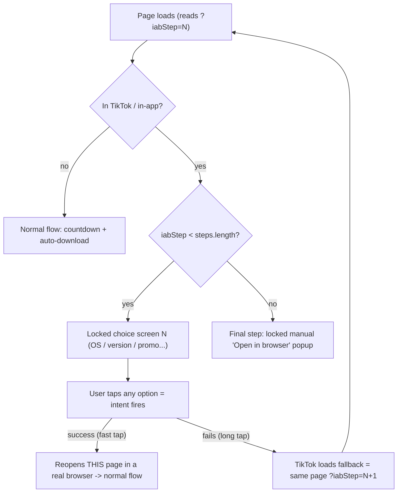

# New Predownload Flow: Multi-Step Intent Gate

This documents the in-app-browser gate in
[`predownload-flow/meccha-download.html`](../predownload-flow/meccha-download.html)
after integrating the multi-fallback-intent idea into the single predownload page.

The goal: escape TikTok's (and similar) in-app browser reliably, without hand-authoring
a chain of separate HTML files like the old
[`multi-fallback-intent-flow/`](../multi-fallback-intent-flow) pages.

## Visual theme

The download page UI matches the landing page ([`predownload-flow/meccha.html`](../predownload-flow/meccha.html)):

- Dark neon palette (`--green`, `--lime`, `--pink`, `--blue`, `--purple`, translucent `--card`)
- Inter + Fredoka fonts
- Sticky topbar + floating bottom dock CTAs
- Hero card with animated blobs / conic glow
- Numbered `.steps` and icon `.features` cards
- Intent-gate overlays use the same dark neon panel styling

Predownload behavior (`data-pd` hooks, countdown, install guide, multi-step intent gate) is unchanged.

## The problem it solves

`intent://` navigation is unreliable inside TikTok's in-app browser:

- **Fast tap** -> the intent fires, Chrome/an external app opens, the user escapes.
- **Long tap (not a hold, just a slower click)** -> the intent silently fails and TikTok
  loads the intent's `S.browser_fallback_url` inside its own webview, trapping the user.

There is no reliable API to force the intent to fire, so the mitigation is to **give the
user more intents to tap**. The old approach chained multiple HTML files (each page's
fallback = the next page). This flow reproduces that chain inside one page.

## Core idea

Each "step" is a disguised choice screen (choose OS, choose version, choose promo, ...).
Every option on a screen is the **same** `intent://` link, and that link encodes both
outcomes at once:

```text
intent://<this-page-clean>#Intent;scheme=https;package=com.android.chrome;S.browser_fallback_url=<this-page?iabStep=N+1>;end
```

- **Success (fast tap):** the OS opens the clean target (this page) in a real browser.
  Once outside TikTok the in-app detector returns `false`, so the normal countdown +
  auto-download just runs. No JS "success" branch is needed.
- **Failure (long-tap bug):** TikTok loads `S.browser_fallback_url`, which is this same
  page at `?iabStep=N+1`. The page reloads straight onto the **next** choice screen.

So we never detect success/failure in JavaScript — the `iabStep` URL counter **is** the
state, driven entirely by navigation. After the configured steps are exhausted, the page
shows the locked manual "open in browser" popup as the final step.

## Flow diagram



With the default 3 steps, a trapped user gets 4 intent opportunities before nothing more
can be done automatically: step 0 (OS) -> step 1 (version) -> step 2 (promo) -> final popup.

## Configuration

All behavior is driven by the JSON in the `#preDownloadPayload` script tag. Relevant keys:

| Key | Type | Purpose |
| --- | --- | --- |
| `downloadUrl` | string | APK hop after countdown. If the landing CTA is already this product’s `/download/` page, keep the existing payload URL. If the landing is getapp/guide, unwrap `intent://` to HTTPS and decode `&amp;` → `&`. If the landing has no download URL, ask. Canonical getapp (`gta-fivem`): `https://th.one2go.store/getapp?app_id=gtafivem&rx=th&pf=tt&vx=3`. Do not edit the landing href. |
| `inAppBrowserGateEnabled` | boolean | Master switch for the whole gate. If `false`, the page never gates. |
| `inAppBrowserDetectors` | array | UA regex detectors, e.g. the `tiktok` pattern. Unchanged from before. |
| `intentGateEnabled` | boolean | Enables the multi-step choice flow. If `false` (or `intentGateSteps` empty), it falls back to the single manual popup (legacy behavior). |
| `intentGatePackage` | string | Android package the intent targets (`com.android.chrome`). Set to `""` to omit `package=` and let the OS pick the default browser. |
| `intentGateSteps` | array | Ordered list of choice screens (see below). |
| `inAppBrowserTitle` / `inAppBrowserMessage` | string | Title/body of the **final** manual popup. |
| `inAppBrowserManualHeading` / `inAppBrowserStepMenu` / `inAppBrowserStepOpenBrowser` | string | Manual "tap the menu -> Open in browser" instructions on the final popup. |
| `inAppBrowserOpenLabel` | string | Label of the final popup's Android intent button. |

### `intentGateSteps` shape

```json
"intentGateSteps": [
  {
    "id": "os",
    "title": "Alege platforma",
    "subtitle": "Selectează dispozitivul pentru a continua",
    "options": [
      { "label": "Android (APK)", "desc": "Recomandat - instalare rapidă", "badge": "Recomandat", "recommended": true },
      { "label": "iPhone / iPad", "desc": "Safari / iOS" },
      { "label": "Windows (PC)", "desc": "Fișier .EXE" }
    ]
  }
]
```

Per-step fields:

- `id` (string) - used in tracking as `step_id`.
- `title` (string) - large heading on the choice screen.
- `subtitle` (string, optional) - sub-line under the title.
- `options` (array) - one or more choices. **Every option fires the same intent**; which
  one is tapped only changes the tracked `option_label`.

Per-option fields:

- `label` (string) - main text.
- `desc` (string, optional) - secondary line.
- `badge` (string, optional) - pill on the right (e.g. "Recomandat"). If omitted, a `->`
  arrow is shown instead.
- `recommended` (boolean, optional) - highlights the row.

To change the number of steps, just add/remove entries in `intentGateSteps`. No code
changes are required.

## What happens in a real browser (no gate)

Nothing changes. If the detector does not match, `renderIntentGate()` releases any block
and the existing logic runs: countdown -> `startDownload()` -> install guide, exactly as
before. The `iabStep` param, if present, is simply ignored.

## Success / failure detection

There is **no** JavaScript success/failure callback — the `intent://` URL handles it via
navigation:

- Success removes the user from our page (they land here in real Chrome), so there is
  nothing for us to detect.
- Failure is a full-page navigation to `S.browser_fallback_url` = this page at the next
  step, which is how the next screen appears.

Consequences:

- **Each failed tap advances exactly one step**, because `iabStep=N+1` is baked into that
  step's fallback. All options on a screen share the same next-step fallback.
- **Returning to TikTok after a success is harmless.** The `pageshow` / `visibilitychange`
  re-sync re-renders the *same* step (it never advances, since advancing only happens
  through the fallback navigation changing the URL), so it is not miscounted as a failure.

A timer heuristic (`setTimeout` + `document.visibilityState`) is intentionally **not**
used; the fallback URL already gives a deterministic failure path. The only thing a timer
would add is per-tap failure telemetry (see below).

## Tracking

On every option tap (and the final popup's open button), the page fires a best-effort
event through the existing download-funnel helper:

```js
downloadFunnel.track('predownload_intent_step', {
  step_id: <step.id or "step-N" or "final">,
  option_label: <tapped option label>,
  step_index: <0-based step index; steps.length for final>
});
```

This never calls `preventDefault`, so the intent navigation always proceeds. Because a
failed intent reloads the page, the reliable success signal remains "the user reached a
real browser"; per-tap *failure* counting would require the optional timer described above.

## Key functions (in `meccha-download.html`)

All live in the runtime IIFE, replacing the old single-popup block:

- `detectInAppBrowser()` - UA regex match (unchanged).
- `readIntentGateStep()` - parses `?iabStep` (default 0).
- `buildGateQuery(stepValue)` - rebuilds the query, dropping old `iabStep`, preserving
  tracking params, optionally appending a new `iabStep`.
- `buildStepIntentUrl(nextStepIndex)` - builds the `intent://` with a clean success target
  and a `S.browser_fallback_url` pointing at `?iabStep=nextStepIndex`.
- `renderIntentStep(step, index)` - renders a locked choice screen.
- `renderFinalPopup(info)` - renders the locked manual popup (final step).
- `renderIntentGate()` - orchestrator: not in-app -> release; else render step or final.
- `releaseInAppBrowserBlock()` - unlocks scroll, removes overlay/styles, resumes download.

While any overlay is shown, `inAppBrowserBlocked` stays `true`, which suppresses
`maybeStartAutoDownload()` so the download only ever fires in a real browser.

## Manual testing

1. **Real mobile browser / desktop:** open the page; confirm the countdown and
   auto-download behave exactly as before (no overlay).
2. **Simulated in-app browser:** spoof the User-Agent to match the `tiktok` detector
   (e.g. append `TikTok` / `musical_ly/… ` to the UA via device emulation), then reload:
   - Step 1 ("Alege platforma") appears, scroll locked.
   - Tapping an option navigates to the intent. In a desktop emulator the app won't launch,
     so the fallback loads `?iabStep=1` -> step 2 ("Alege versiunea").
   - Continue to `?iabStep=2` (step 3, "Revendică bonusul"), then `?iabStep=3` -> the
     manual "open in browser" popup.
3. **Backward-compat:** set `intentGateEnabled` to `false` (or empty `intentGateSteps`) and
   confirm the single manual popup shows immediately, as in the legacy flow.

## Out of scope / notes

- The `multi-fallback-intent-flow/*.html` files are left as reference and are not used by
  this flow.
- No server/template changes: the page is self-contained and reads its JSON payload at
  runtime, so editing `intentGateSteps` is enough to reconfigure the flow.
