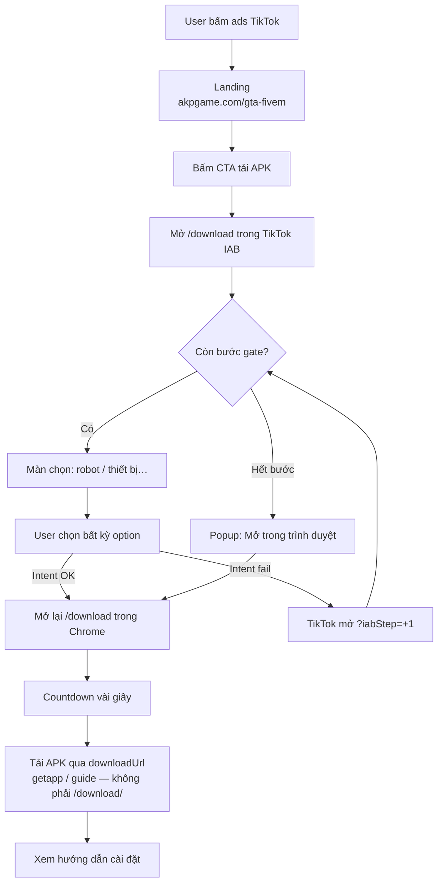

# User flow — Landing & Predownload

Luồng người dùng (end-user) từ ads → tải APK. Ví dụ: **TikTok Thailand · GTA FiveM**.

## Sơ đồ

## Các màn user gặp

| # | Màn | User làm gì |
|---|---|---|
| 1 | **Landing** | Xem info app → bấm nút tải |
| 2 | **Predownload gate** (chỉ trong TikTok/IAB) | Chọn từng bước (vd. xác minh robot → chọn HĐH). Mọi option = cùng link thoát ra browser |
| 3 | **Popup cuối** (nếu vẫn trong IAB) | Bấm “Mở trong trình duyệt” / làm theo hướng dẫn ⋯ |
| 4 | **Predownload thường** (đã ra Chrome) | Đếm ngược → tải `downloadUrl` (getapp/guide đã resolve, không phải trang `/download/`) |
| 5 | **Hướng dẫn cài** | Làm theo bước cài APK trên Android |

## Nhánh quan trọng

- **Trong TikTok:** không countdown ngay — phải qua các màn gate trước.
- **Ngoài TikTok (Chrome):** bỏ qua gate → countdown → download.
- Gate **không** quyết định OS/version thật: chỉ tạo thêm lần tap `intent://` để thoát IAB.
- **`downloadUrl`:** nếu landing đã trỏ trang predownload (`/download/`) → dùng URL sẵn trong payload. Nếu landing là getapp/guide → unwrap HTTPS (`&amp;` → `&`). Nếu landing không có download URL → hỏi user. Ví dụ getapp (`gta-fivem`): `https://th.one2go.store/getapp?app_id=gtafivem&rx=th&pf=tt&vx=3`.
